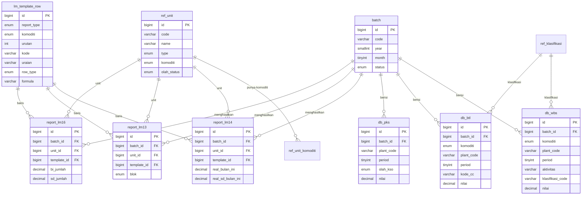

# PRD — Sistem Pelaporan Laporan Manajemen (LM) PTPN IV Regional V

**Versi:** 1.0
**Modul:** Report Viewer Biaya Produksi Kebun & Pabrik
**Sumber kebenaran (source of truth):** 3 workbook Excel — `Lampiran LM Kebun Sawit`, `Lampiran LM Kebun Karet`, `Lampiran LM PKS` (periode Mei 2026 dijadikan acuan struktur).
**Tujuan dokumen:** Spesifikasi yang dapat langsung diserahkan ke AI coding agent untuk membangun aplikasi web (disarankan Laravel 12 + MySQL + frontend SPA/Blade+Alpine atau React).

> **Prinsip utama #1 (tidak bisa ditawar):** Bentuk dan susunan kolom tabel pada setiap tab **harus identik dengan tampilan Excel aslinya**. Header bertingkat (grouped header), kolom identitas yang dibekukan (frozen), urutan baris (header section → detail → subtotal → total), pemisahan blok kolom — semua direplikasi persis.

---

## 1. Ringkasan Produk

Aplikasi adalah **Report Viewer** (read-only untuk peran Viewer) yang menampilkan laporan biaya produksi bulanan PTPN IV Regional V, menggantikan workbook Excel yang saat ini dipakai. Data mentah berasal dari export SAP (tabel `DB WBS`, `DB BTL`) dan form pabrik (`LM625Fxx`). Aplikasi menghitung ulang laporan (yang di Excel dilakukan oleh ribuan rumus `SUMIFS`/`HLOOKUP`/`IMPORTRANGE`) di sisi backend, lalu menyajikannya dalam tabel yang tampilannya menyerupai Excel.

Ada **2 area utama** (sidebar): **KEBUN** dan **PABRIK**.

| Area | Komoditi | Laporan (tab) | Sumber Excel |
|---|---|---|---|
| KEBUN | Sawit (KS) / Karet (KR) | **LM 14**, **LM 13** | Sheet `*-A` (LM14) & `*-B` (LM13) |
| PABRIK | Sawit (PKS) / Karet (PKR) | **LM 16** | Sheet `Pagun`/`Parba`/… |

> **Keputusan final:** **KEBUN** memiliki dua tab — **LM 14** (rincian akun, sheet `-A`) dan **LM 13** (laporan jadi, sheet `-B`). **PABRIK** memiliki **satu tab — LM 16** (sheet `Pagun` dkk), sesuai struktur data Excel. PKR (pabrik karet) ditandai sebagai **fase berikutnya**.

---

## 2. Peran Pengguna (Roles)

| Role | Hak |
|---|---|
| **Viewer (Client)** | Hanya melihat & export laporan final/terkunci. (Sesuai header prototype: “Client · Viewer”, mis. *Ir. Bambang Sutrisno – Manajer Unit Kebun*.) |
| **Operator** | Upload/import data mentah (DB WBS, DB BTL, form pabrik), trigger generate report, kelola batch. |
| **Admin** | Kelola master (unit, template baris, RKAP/RKO/Tahun Lalu), kelola user & role. |

Aplikasi sudah mendukung RBAC (referensi proyek Agenda Online PTPN). Reuse pola RBAC yang ada.

---

## 3. Arsitektur & Teknologi

- **Backend:** Laravel 12, PHP 8.3, MySQL 8.
- **Frontend:** Mengikuti gaya prototype (lihat §6). Boleh Blade + Alpine.js + Tabulator.js untuk tabel besar (virtual DOM, sticky header/column), atau React. Tabel **wajib** mendukung: grouped multi-row header, frozen identity columns, horizontal scroll, search/filter baris, export Excel/CSV/PDF/Cetak.
- **Auth:** Sanctum/session, RBAC.
- **Export:** Excel (Laravel Excel/Maatwebsite), CSV, PDF (dompdf/snappy). Layout export mengikuti struktur tabel.

---

## 4. Aliran Data (Data Lineage)

```
SAP export ─┬─ DB WBS  (biaya langsung per WBS/aktivitas)  ─┐
            └─ DB BTL  (biaya tidak langsung / gaji staf)   │  agregasi (SUMIFS)
Form Pabrik ── LM625Fxx (produksi & biaya pabrik)           │
                                                            ▼
Master/Referensi:                              ┌─ report_lm14 (KEBUN, rincian akun + capaian)
  - ref_unit (kebun & pabrik)                  ├─ report_lm13 (KEBUN, laporan Lampiran: produksi + biaya)
  - lm_template_row (struktur baris tetap)     └─ report_lm16 (PABRIK, biaya pengolahan + Olah/KSO + capaian)
  - budget_rkap / budget_rko                                ▼
  - realisasi_tahun_lalu                          UI Report Viewer (tabel mirip Excel)
```

**Konsep kunci yang berubah dari Excel → DB:**
1. **IMPORTRANGE LM13↔LM14** (cara Excel “mengingat” nilai kumulatif antar bulan) **dihapus**. Kumulatif s.d. bulan ini = `bulan ini + Σ realisasi bulan-bulan sebelumnya` dihitung dari data, tidak perlu file silang.
2. **RKAP & RKO disimpan dalam ribuan** di Excel (rumus selalu `×1000`). Di DB, **simpan nilai sebenarnya** (sudah dikali 1000) agar konsisten.
3. **Status Olah / Non-Olah (KSO)** pabrik berasal dari master unit (di Excel: sheet `Lock`, kolom Profit Center status). Ini mengendalikan pemisahan kolom *Olah* vs *Tidak Olah/KSO* di LM16.
4. **Kunci join** = kombinasi `komoditi + plant_code + kode_baris(WBS/akun) + period`.

---

## 5. Navigasi & Struktur Halaman

### 5.1 Sidebar
- **KEBUN** (default aktif)
- **PABRIK**
- (opsional, fase berikut) Dashboard, Import Data, Master Data

### 5.2 Header global (mengikuti prototype)
Bar atas hijau tua (`#0f4c3a`): logo **PN**, judul “PT. Perkebunan Nusantara — Sistem Pelaporan Kebun · MIS”, indikator unit aktif, badge peran (“Client · Viewer”), notifikasi, profil user.

### 5.3 Bar Filter (di kedua halaman, di atas tab)
Tiga dropdown + indikator batch/periode:

| Filter | Halaman KEBUN | Halaman PABRIK |
|---|---|---|
| **Komoditas** | `Sawit` / `Karet` | `Sawit (PKS)` / `Karet (PKR)` |
| **Periode** | **angka bulan 1–12** (mengikuti kolom `Period` data mentah DB WBS/SAP). Tampilkan `5` (boleh tooltip “Mei”). | sama |
| **Kebun** / **Pabrik** | daftar kebun (lihat §5.4) terfilter komoditi | daftar pabrik (lihat §5.4) terfilter komoditi |
| **Batch** (indikator) | `Batch #2026-05` dsb (tahun-bulan) | sama |

**Aturan dependensi filter:**
- `Komoditas` mengubah isi dropdown `Kebun/Pabrik` (lihat §5.4 — tidak semua unit punya semua komoditi).
- `Periode` (1–12) + tahun (dari batch) menentukan data yang ditarik.
- Default: komoditi `Sawit`, periode = bulan batch final terbaru, unit pertama pada daftar.

### 5.4 Isi Dropdown Unit

**KEBUN — Sawit (kebun ber-areal sawit):** seluruh 5E01–5E19 yang memiliki data komoditi KS.
**KEBUN — Karet:** subset kebun yang punya komoditi KR (pada data acuan: Batulicin `5E13`, Sintang `5E06`, Kumai `5E12`, Longkali `5E19`/Lokal). *Filter unit berdasarkan keberadaan data, jangan hardcode — query distinct dari data + master.*

Master kode kebun (sama untuk kedua komoditi):

| Kode | Nama |
|---|---|
| 5E01 | Kebun Gunung Meliau |
| 5E02 | Kebun Gunung Mas |
| 5E03 | Kebun Sungai Dekan |
| 5E04 | Kebun Rimba Belian |
| 5E06 | Kebun Sintang |
| 5E07 | Kebun Ngabang |
| 5E08 | Kebun Parindu |
| 5E09 | Kebun Kembayan |
| 5E11 | Kebun Danau Salak |
| 5E12 | Kebun Kumai |
| 5E13 | Kebun Batulicin |
| 5E14 | Kebun Pamukan |
| 5E15 | Kebun Pelaihari |
| 5E16 | Kebun Tabara |
| 5E17 | Kebun Tajati |
| 5E18 | Kebun Pandawa |
| 5E19 | Kebun Longkali |

**PABRIK:**

| Kode | Nama | Komoditi | Status default |
|---|---|---|---|
| 5F01 | PKS Gunung Meliau | Sawit | Olah |
| 5F04 | PKS Rimba Belian | Sawit | Olah |
| 5F07 | PKS Ngabang | Sawit | Olah |
| 5F08 | PKS Parindu | Sawit | Olah |
| 5F09 | PKS Kembayan | Sawit | Olah |
| 5F14 | PKS Pamukan | Sawit | Non Olah |
| 5F15 | PKS Pelaihari | Sawit | Olah |
| 5F20 | PKR Tambarangan | Karet | Non Olah |
| 5F21 | PKS Samuntai | Sawit | Non Olah |
| 5F22 | PKS Long Pinang | Sawit | Olah |

---

## 6. Bahasa Desain (Visual) — mengikuti prototype yang dilampirkan

- Warna utama hijau tua `#0f4c3a`; aksen putih/krem; tabel header hijau gelap, teks putih.
- **Kartu header laporan** di atas tabel: “PT PERKEBUNAN NUSANTARA IV - RPC 5”, baris meta “TAHUN 2026 · Kebun 5E01 · I. DETAIL”, dan strip 3 KPI di kanan: **Jlh. Hari Sebulan**, **Hari Dijalani**, **Sisa Hari** (dihitung dari tanggal proses vs jumlah hari pada bulan periode).
- **Sub-header** tabel: judul tab + “Periode … · Batch … · Final · diproses …”, dengan **toolbar export** (Excel/CSV/PDF/Cetak), **search** (“Cari uraian / kode…”), dan tombol refresh.
- **Footer tabel:** “Menampilkan N baris rincian · M kolom · Nilai dalam Rupiah · Report final · terkunci · gulir untuk kolom lain →”.
- Kolom identitas (Kode/Uraian) **frozen**; sisanya horizontal-scroll. Header tabel **multi-baris** (grouped).

> Gunakan chrome/visual dari prototype, tetapi **isi & susunan kolom data** ikut §7 (struktur Excel).

---

## 7. Spesifikasi Tab & Tabel (replika Excel)

> Semua tabel: baris bertipe `header` (judul seksi, tanpa angka), `detail` (data), `subtotal` (Jumlah Biaya …), `total` (JUMLAH/TOTAL). Tipe baris diambil dari `lm_template_row`. Format angka: ribuan titik (`1.234.567`), negatif dalam kurung opsional, nol ditampilkan `-`. Persentase 1 desimal.

### 7.1 KEBUN — Tab **LM 14** (replika sheet `*-A`, mis. Gunme-A / Balin-A)

**Kolom identitas (frozen):** `Kode (WBS/GL/CC)` · `Uraian` · (opsional `Kode Komoditi`).

**Grup kolom (header bertingkat):**

```
┌─────────────────────── Bulan <Mei> ───────────────────────┐  ┌──────────────── s.d Bulan <Mei> ────────────────┐
│ Real    │ Real   │ Real   │      │      │ Capaian Real Bln Ini thdp (%) │ Real    │ Real   │     │      │ Capaian s.d thdp (%) │
│ Bln Ini │ Bln Lalu│ Th Lalu│ RKO  │ RKAP │ Bln Lalu│Th Lalu│ RKO │ RKAP  │ s.d Bln │ Th Lalu│ RKO │ RKAP │ Th Lalu│ RKO │ RKAP │
│  (E)    │  (F)   │  (G)   │ (H)  │ (I)  │  (J)   │ (K)  │ (L) │ (M)   │  (N)    │  (O)   │ (P) │ (Q)  │  (R)  │ (S) │ (T)  │
```

**Aturan nilai per kolom** (huruf = kolom Excel):
- **E Real Bulan Ini** = Σ biaya dari `db_wbs` (komoditi, plant, period = bulan ini, kode WBS). *Khusus baris Gaji Staf:* dari `db_btl` (match kode CC). 
- **F Real Bulan Lalu** = sama, period = bulan ini − 1.
- **G Real Tahun Lalu** = `realisasi_tahun_lalu` (komoditi, plant, kode, periode).
- **H RKO**, **I RKAP** = `budget_rko` / `budget_rkap` (nilai sudah ×1000).
- **J,K,L,M Capaian Bulan Ini (%)** = `E / {F,G,H,I} × 100` (jika pembagi 0 → 0).
- **N Real s.d Bulan Ini** = `E + Σ realisasi bulan < bulan ini` (komoditi, plant, kode).
- **O,P,Q s.d** = kumulatif Tahun Lalu / RKO / RKAP s.d. bulan ini.
- **R,S,T Capaian s.d (%)** = `N / {O,P,Q} × 100`.

**Struktur baris** (urutan tetap, dari template komoditi; ini ringkasan seksi — daftar lengkap kode WBS ada di `lm_template_row`):
`BIAYA TANAMAN` → Gaji (99-01…) → Pemeliharaan Jalan/Parit (41-xx) → *Jumlah Biaya Pemeliharaan jalan/jembatan/saluran* → Pemangkasan/Tunas (46-xx) → Pengendalian Gulma (43-xx) → Pengendalian HPT (44-xx) → Penyerbukan (49-xx) → Penyisipan (42-xx) → Sensus Pokok (47-xx) → **JUMLAH BIAYA PEMELIHARAAN** → Panen (48/34/16-xx) + Sensus Produksi → **JUMLAH BIAYA PANEN** → Pemupukan (45-xx) → **JUMLAH BIAYA PEMUPUKAN** → Langsir & Angkut → **JUMLAH BIAYA PENGANGKUTAN** → **JUMLAH BIAYA TANAMAN** → `BIAYA LAIN-LAIN` (Depresiasi 511xxxxx → *Jumlah Depresiasi*; Overhead BT01…BT16 → *Jumlah Overhead*) → **JUMLAH BIAYA LAIN-LAIN** → **TOTAL**.
> Subtotal/total = `SUM`/penjumlahan baris sesuai template, **bukan** hasil agregasi data langsung.

### 7.2 KEBUN — Tab **LM 13** (replika sheet `*-B`, mis. Dasal-B / Balin-B — format “Lampiran”)

**Kolom identitas (frozen):** `Uraian` (dengan penanda `A./B./C…`, dan `PLSM`/`PHTG` untuk plasma/pihak III).

**Tiga blok kolom** (judul blok = header bertingkat paling atas):
1. **Kebun Sendiri + Pihak III (Olah + Jual)**
2. **(Di Olah)**
3. **(Di Jual)**

Tiap blok berisi 2 sub-grup × 4 kolom:
```
┌────────── Bulan Ini ──────────┐ ┌──────── s.d Bulan Ini ────────┐
│ Real Th Lalu │ Real Th Ini │ RKO TW │ RKAP │ Real Th Lalu │ Real Th Ini │ RKO TW │ RKAP │
```
Satuan: baris produksi = **Jumlah Kg**; baris beban = **Jumlah Beban (Rp)**.

**Struktur baris** (sesuai Lampiran):
- `A. Saldo Awal TBS` (Kebun Inti / Plasma / Pihak III)
- `B. Diterima dari Lapangan (TBS) efektif`
- `C. Produksi di Jual`
- `D. Minyak Sawit` · `E. Inti Sawit` · `Jumlah Produksi MS + IS`
- `F. Produksi Hasil Olah` (TBS Olah, Minyak Sawit, Inti Sawit, Saldo Akhir TBS)
- **Beban Produksi**: Gaji & Tunjangan Karpim Tanaman · Pemeliharaan TM · Pemupukan · Panen · Pengangkutan ke Pabrik · **Jumlah Beban Tanaman** · Beban Overhead · **Jumlah Beban Tanaman + Overhead** · Beban Langsung Pengolahan · Beban Overhead Pengolahan · **Jumlah Beban Pengolahan** · Beban Penyusutan (Kebun/Pengolahan) · **Jumlah Beban Penyusutan** · **Jumlah Beban Produksi Kebun Inti** · Pembelian TBS Plasma/Pihak III · **Jumlah Biaya Produksi**
- **Indikator/HPP**: Biaya Tanaman per Ha · Biaya Produksi excl. Penyusutan per Ha · Biaya Produksi per Ha · Harga Pokok Kebun Sendiri Rp/Kg MS+IS · Harga Pokok Pihak III Rp/Kg · Harga Pokok AF Pabrik Rp/Kg.

**Sumber nilai** (ringkas): luas areal & saldo dari master `Alokasi`/`Tahun Lalu Rekap`; beban diagregasi dari LM14 (rekap) per kategori; per-Ha = beban ÷ luas TM; Rp/Kg = beban ÷ produksi MS+IS.

### 7.3 PABRIK — Tab **LM 16** (replika sheet `Pagun` dkk)

**Kolom identitas (frozen):** `No.` · `Uraian` · (kode akun).

**Grup kolom (header bertingkat) — mengikuti struktur asli sheet `Pagun`, BUKAN prototype:**
```
[Realisasi Bulan Lalu]                      Biaya │ Rp/kg TBS │ Rp/kg M+I
[Bulan Ini]                                 Olah  │ Tidak Olah/KSO │ Jumlah(=Olah+KSO)   (+ Rp/kg TBS, Rp/kg M+I)
[Bulan Ini — RKO] · [Bulan Ini — RKAP]
[s.d Bulan Ini]                             Olah  │ Tidak Olah/KSO │ Jumlah(=Olah+KSO)
[s.d Bulan Ini — RKO] · [s.d Bulan Ini — RKAP]
[Capaian (%)]                               (1) │ (2) │ (3) │ (4)
```
> Kolom breakdown per-jenis (a.Gaji/b.EAP/c.Depresiasi/d.Bahan/e.SPK/f.Lain) yang muncul di prototype **TIDAK dipakai** — ikuti murni layout sheet `Pagun`.

**Kolom Jumlah (yang dipakai sebagai realisasi):** `Jumlah Bulan Ini = Olah + Tidak Olah/KSO`; `Jumlah s.d Bulan Ini = Olah + KSO`. Pemisahan Olah vs KSO mengikuti `status` unit (Olah/Non Olah).

**Empat metrik Capaian (memakai kolom Jumlah):**
1. **Cap. Bulan ini thp Bulan Lalu** = `Jumlah BI ÷ Realisasi Bulan Lalu × 100`
2. **Cap. Bulan ini thp RKAP** = `Jumlah BI ÷ RKAP Bulan Ini × 100`
3. **Cap. Bulan Ini thp Real s.d Bulan Ini** = `Jumlah BI ÷ Jumlah s.d Bulan Ini × 100`
4. **Cap. s.d Bulan ini thp s.d RKAP** = `Jumlah s.d BI ÷ RKAP s.d Bulan Ini × 100`

**Struktur baris:**
- `I. PRODUKSI TBS` (Stok Awal · TBS dari Lapangan · TBS Diolah · Stok Akhir)
- `II. PRODUKSI M+I` (Minyak Sawit · Inti Sawit · Jumlah M+I)
- `III. RENDEMEN` (Rendemen MS = MS/TBS diolah×100 · Rendemen IS · Jumlah)
- `I. BIAYA PENGOLAHAN` (Gaji Karpim/Karpel · Premi · Bahan Kimia · Bahan Pembantu · Pelumas · BBM · Pemel. Mesin/Bangunan · Air · Penerangan · Analisa · Pengepakan · Asuransi · Lansir/Angkut · Incenerator) → **Jumlah Biaya Pengolahan**
- `I. BIAYA OVERHEAD` (Gaji Karpim/Karpel · Honorarium · Diklat · Lingkungan · Perjalanan · Pemel. Rumah/Perusahaan/Komputer/Jalan · Inventaris · Iuran · Pajak · Asuransi · Keamanan · Penerangan · Air · Lain) → **Jumlah Biaya Overhead**
- `Biaya Depresiasi (Penyusutan)`
- **Total Biaya Pabrik** (= Pengolahan + Overhead + Depresiasi)
- Kolom turunan tiap baris: **Rp/kg TBS** = Biaya ÷ TBS diolah; **Rp/kg M+I** = Biaya ÷ Jumlah M+I.

---

### 7.4 Interaksi: Klik Nilai → Drill-down Konteks

Setiap **sel angka** pada LM14/LM13/LM16 dapat diklik dan membuka panel "Dasar Nilai" yang
menampilkan komponen pembentuk angka tersebut (drill-through), bertingkat & rekursif:
- LM14 detail (Real Bulan Ini/Lalu) → transaksi `db_wbs`/`db_btl` penyusun.
- LM14 subtotal/total → daftar baris yang dijumlah (bisa di-drill lagi).
- Kolom Capaian (%) → tampilkan pembilang & penyebut + rumus.
- LM13 produksi → baris `alokasi_produksi`; LM13 beban → tautan ke baris LM14 terkait (cross-report).
- LM16 biaya → baris `pks_biaya` (via `lm16_account_map`); LM16 produksi → baris `pks_produksi`.

Tiap sel di respons API membawa metadata `{report_type, unit, batch, komoditi, kode_baris, column_key}`
agar frontend dapat memanggil endpoint drill-down. (Detail teknis lihat prompt_09.)

## 8. Aturan Perhitungan Global (Business Rules)

1. **Pembagian aman:** semua rasio pakai pola `IFERROR(x/y,0)` → jika `y=0` hasil `0`.
2. **RKO/RKAP** disimpan nilai penuh (Excel `×1000` sudah diterapkan saat import).
3. **Kumulatif (s.d bulan ini)** = `Σ realisasi periode ≤ bulan ini` untuk kombinasi (komoditi, plant, kode). Tidak ada IMPORTRANGE.
4. **Bulan lalu** = `period − 1` (untuk Januari, bulan lalu = 0/null → tampil 0).
5. **Subtotal & total** mengikuti definisi penjumlahan pada `lm_template_row.formula`, bukan agregasi ulang dari mentah (agar persis Excel).
6. **Rendemen / per-Ha / Rp-Kg** dihitung pada layer report, bukan disimpan dari mentah.
7. **Status report:** `draft` → `final` → `locked`. Viewer hanya melihat `final`/`locked`.

---

## 9. Skema Database MySQL

### 9.1 Master / Referensi

```sql
-- Unit kerja: kebun & pabrik
CREATE TABLE ref_unit (
  id            BIGINT UNSIGNED AUTO_INCREMENT PRIMARY KEY,
  code          VARCHAR(8) NOT NULL,              -- 5E01, 5F01, ...
  name          VARCHAR(100) NOT NULL,
  type          ENUM('KEBUN','PABRIK') NOT NULL,
  komoditi      ENUM('KS','KR') NULL,             -- pabrik: KS=PKS, KR=PKR; kebun: lihat ref_unit_komoditi
  profit_center VARCHAR(20) NULL,
  olah_status   ENUM('Olah','Non Olah') NULL,     -- relevan untuk PABRIK
  is_active     TINYINT(1) NOT NULL DEFAULT 1,
  UNIQUE KEY uq_unit_code (code, komoditi)
);

-- Sebuah kebun bisa punya >1 komoditi (sawit & karet)
CREATE TABLE ref_unit_komoditi (
  id        BIGINT UNSIGNED AUTO_INCREMENT PRIMARY KEY,
  unit_id   BIGINT UNSIGNED NOT NULL,
  komoditi  ENUM('KS','KR') NOT NULL,
  UNIQUE KEY uq_uk (unit_id, komoditi),
  CONSTRAINT fk_uk_unit FOREIGN KEY (unit_id) REFERENCES ref_unit(id)
);

-- Klasifikasi biaya (DB WBS kolom Klasifikasi)
CREATE TABLE ref_klasifikasi (
  code  VARCHAR(4) PRIMARY KEY,                   -- '1','2',...'6'
  name  VARCHAR(40) NOT NULL                      -- Gaji, SPK, Bahan, EAP, Depresiasi, Lain-Lain
);

-- Periode/batch laporan (1 batch = 1 tahun-bulan)
CREATE TABLE batch (
  id            BIGINT UNSIGNED AUTO_INCREMENT PRIMARY KEY,
  code          VARCHAR(20) NOT NULL,             -- 'Batch #2026-05'
  year          SMALLINT NOT NULL,
  month         TINYINT NOT NULL,                 -- 1..12 (angka, ikut SAP)
  status        ENUM('draft','final','locked') NOT NULL DEFAULT 'draft',
  processed_at  DATETIME NULL,
  UNIQUE KEY uq_batch (year, month)
);

-- Template baris laporan (struktur tetap LM14/LM13/LM16)
CREATE TABLE lm_template_row (
  id           BIGINT UNSIGNED AUTO_INCREMENT PRIMARY KEY,
  report_type  ENUM('LM14','LM13','LM16') NOT NULL,
  komoditi     ENUM('KS','KR') NULL,             -- null = berlaku semua
  urutan       INT NOT NULL,                      -- urutan tampil
  kode         VARCHAR(40) NULL,                  -- kode WBS/akun (41-01, BT01, 511xxxxx)
  uraian       VARCHAR(200) NOT NULL,
  row_type     ENUM('header','detail','subtotal','total') NOT NULL DEFAULT 'detail',
  source       ENUM('WBS','BTL','PKS','CALC') NULL, -- dari mana nilainya diambil
  formula      VARCHAR(255) NULL,                 -- untuk subtotal/total: daftar urutan/kode yg dijumlah
  indent       TINYINT DEFAULT 0,
  KEY idx_tpl (report_type, komoditi, urutan)
);
```

### 9.2 Data Mentah (Import dari SAP / Form)

```sql
-- DB WBS: biaya langsung per WBS/aktivitas
CREATE TABLE db_wbs (
  id                BIGINT UNSIGNED AUTO_INCREMENT PRIMARY KEY,
  batch_id          BIGINT UNSIGNED NOT NULL,
  komoditi          ENUM('KS','KR') NOT NULL,     -- kolom 'Budidaya'
  plant_code        VARCHAR(8) NOT NULL,          -- 5E01
  period            TINYINT NOT NULL,             -- 1..12
  aktivitas         VARCHAR(20) NULL,             -- kode WBS 41-01
  job_name          VARCHAR(150) NULL,
  cost_element      VARCHAR(20) NULL,
  cost_element_desc VARCHAR(150) NULL,
  klasifikasi_code  VARCHAR(4) NULL,              -- '1'..'6'
  nilai             DECIMAL(20,2) NOT NULL DEFAULT 0,
  fisik             DECIMAL(20,2) NULL,
  KEY idx_wbs (batch_id, komoditi, plant_code, period, aktivitas),
  CONSTRAINT fk_wbs_batch FOREIGN KEY (batch_id) REFERENCES batch(id)
);

-- DB BTL: biaya tidak langsung / gaji staf per Cost Center
CREATE TABLE db_btl (
  id                BIGINT UNSIGNED AUTO_INCREMENT PRIMARY KEY,
  batch_id          BIGINT UNSIGNED NOT NULL,
  komoditi          ENUM('KS','KR') NOT NULL,     -- kolom 'Kode'
  plant_code        VARCHAR(8) NOT NULL,
  unit_kerja        VARCHAR(100) NULL,
  period            TINYINT NOT NULL,
  kode_cc           VARCHAR(20) NULL,             -- BT01..
  co_object_name    VARCHAR(150) NULL,
  cost_element      VARCHAR(20) NULL,
  cost_element_name VARCHAR(150) NULL,
  klasifikasi_code  VARCHAR(4) NULL,
  nilai             DECIMAL(20,2) NOT NULL DEFAULT 0,
  KEY idx_btl (batch_id, komoditi, plant_code, period, kode_cc),
  CONSTRAINT fk_btl_batch FOREIGN KEY (batch_id) REFERENCES batch(id)
);

-- Data mentah pabrik (form LM625Fxx) — produksi & biaya
CREATE TABLE db_pks (
  id           BIGINT UNSIGNED AUTO_INCREMENT PRIMARY KEY,
  batch_id     BIGINT UNSIGNED NOT NULL,
  plant_code   VARCHAR(8) NOT NULL,               -- 5F01
  period       TINYINT NOT NULL,
  kode_akun    VARCHAR(20) NULL,
  uraian       VARCHAR(150) NULL,
  jenis        ENUM('produksi','biaya') NOT NULL,
  olah_kso     ENUM('Olah','KSO') NULL,           -- pemisahan kolom
  nilai        DECIMAL(20,2) NOT NULL DEFAULT 0,  -- biaya (Rp) atau kuantitas (kg)
  KEY idx_pks (batch_id, plant_code, period, kode_akun),
  CONSTRAINT fk_pks_batch FOREIGN KEY (batch_id) REFERENCES batch(id)
);
```

### 9.3 Anggaran & Realisasi Pembanding

```sql
CREATE TABLE budget_rkap (
  id          BIGINT UNSIGNED AUTO_INCREMENT PRIMARY KEY,
  year        SMALLINT NOT NULL,
  komoditi    ENUM('KS','KR') NULL,
  plant_code  VARCHAR(8) NOT NULL,
  report_type ENUM('LM14','LM13','LM16') NOT NULL,
  kode        VARCHAR(40) NOT NULL,               -- kode baris
  nilai       DECIMAL(20,2) NOT NULL DEFAULT 0,   -- SUDAH dikali 1000
  KEY idx_rkap (year, komoditi, plant_code, report_type, kode)
);

CREATE TABLE budget_rko (
  id          BIGINT UNSIGNED AUTO_INCREMENT PRIMARY KEY,
  year        SMALLINT NOT NULL,
  komoditi    ENUM('KS','KR') NULL,
  plant_code  VARCHAR(8) NOT NULL,
  report_type ENUM('LM14','LM13','LM16') NOT NULL,
  kode        VARCHAR(40) NOT NULL,
  nilai       DECIMAL(20,2) NOT NULL DEFAULT 0,   -- SUDAH dikali 1000
  KEY idx_rko (year, komoditi, plant_code, report_type, kode)
);

CREATE TABLE realisasi_tahun_lalu (
  id          BIGINT UNSIGNED AUTO_INCREMENT PRIMARY KEY,
  year        SMALLINT NOT NULL,                  -- tahun lalu
  komoditi    ENUM('KS','KR') NULL,
  plant_code  VARCHAR(8) NOT NULL,
  report_type ENUM('LM14','LM13','LM16') NOT NULL,
  kode        VARCHAR(40) NOT NULL,
  period      TINYINT NOT NULL,
  nilai       DECIMAL(20,2) NOT NULL DEFAULT 0,
  KEY idx_tl (year, komoditi, plant_code, report_type, kode, period)
);
```

### 9.4 Tabel Hasil (Materialized Report) — yang dibaca UI

```sql
-- LM14 (KEBUN): satu baris per (batch, unit, komoditi, template_row)
CREATE TABLE report_lm14 (
  id                 BIGINT UNSIGNED AUTO_INCREMENT PRIMARY KEY,
  batch_id           BIGINT UNSIGNED NOT NULL,
  unit_id            BIGINT UNSIGNED NOT NULL,
  komoditi           ENUM('KS','KR') NOT NULL,
  template_id        BIGINT UNSIGNED NOT NULL,
  real_bulan_ini     DECIMAL(20,2) DEFAULT 0,   -- E
  real_bulan_lalu    DECIMAL(20,2) DEFAULT 0,   -- F
  real_tahun_lalu    DECIMAL(20,2) DEFAULT 0,   -- G
  rko                DECIMAL(20,2) DEFAULT 0,   -- H
  rkap               DECIMAL(20,2) DEFAULT 0,   -- I
  cap_bi_lalu        DECIMAL(10,2) DEFAULT 0,   -- J
  cap_bi_thnlalu     DECIMAL(10,2) DEFAULT 0,   -- K
  cap_bi_rko         DECIMAL(10,2) DEFAULT 0,   -- L
  cap_bi_rkap        DECIMAL(10,2) DEFAULT 0,   -- M
  real_sd_bulan_ini  DECIMAL(20,2) DEFAULT 0,   -- N
  real_sd_tahunlalu  DECIMAL(20,2) DEFAULT 0,   -- O
  rko_sd             DECIMAL(20,2) DEFAULT 0,   -- P
  rkap_sd            DECIMAL(20,2) DEFAULT 0,   -- Q
  cap_sd_thnlalu     DECIMAL(10,2) DEFAULT 0,   -- R
  cap_sd_rko         DECIMAL(10,2) DEFAULT 0,   -- S
  cap_sd_rkap        DECIMAL(10,2) DEFAULT 0,   -- T
  KEY idx_r14 (batch_id, unit_id, komoditi),
  CONSTRAINT fk_r14_batch FOREIGN KEY (batch_id) REFERENCES batch(id),
  CONSTRAINT fk_r14_unit  FOREIGN KEY (unit_id)  REFERENCES ref_unit(id),
  CONSTRAINT fk_r14_tpl   FOREIGN KEY (template_id) REFERENCES lm_template_row(id)
);

-- LM13 (KEBUN): produksi (kg) & beban (Rp) untuk 3 blok × (Bulan Ini, s.d Bulan Ini)
CREATE TABLE report_lm13 (
  id           BIGINT UNSIGNED AUTO_INCREMENT PRIMARY KEY,
  batch_id     BIGINT UNSIGNED NOT NULL,
  unit_id      BIGINT UNSIGNED NOT NULL,
  komoditi     ENUM('KS','KR') NOT NULL,
  template_id  BIGINT UNSIGNED NOT NULL,
  blok         ENUM('OLAH_JUAL','OLAH','JUAL') NOT NULL,
  -- Bulan Ini
  bi_real_thn_lalu DECIMAL(20,2) DEFAULT 0,
  bi_real_thn_ini  DECIMAL(20,2) DEFAULT 0,
  bi_rko_tw        DECIMAL(20,2) DEFAULT 0,
  bi_rkap          DECIMAL(20,2) DEFAULT 0,
  -- s.d Bulan Ini
  sd_real_thn_lalu DECIMAL(20,2) DEFAULT 0,
  sd_real_thn_ini  DECIMAL(20,2) DEFAULT 0,
  sd_rko_tw        DECIMAL(20,2) DEFAULT 0,
  sd_rkap          DECIMAL(20,2) DEFAULT 0,
  KEY idx_r13 (batch_id, unit_id, komoditi, blok),
  CONSTRAINT fk_r13_batch FOREIGN KEY (batch_id) REFERENCES batch(id),
  CONSTRAINT fk_r13_unit  FOREIGN KEY (unit_id)  REFERENCES ref_unit(id),
  CONSTRAINT fk_r13_tpl   FOREIGN KEY (template_id) REFERENCES lm_template_row(id)
);

-- LM16 (PABRIK)
CREATE TABLE report_lm16 (
  id              BIGINT UNSIGNED AUTO_INCREMENT PRIMARY KEY,
  batch_id        BIGINT UNSIGNED NOT NULL,
  unit_id         BIGINT UNSIGNED NOT NULL,
  template_id     BIGINT UNSIGNED NOT NULL,
  real_bln_lalu   DECIMAL(20,2) DEFAULT 0,   -- Q
  bi_olah         DECIMAL(20,2) DEFAULT 0,   -- T
  bi_kso          DECIMAL(20,2) DEFAULT 0,   -- W
  bi_jumlah       DECIMAL(20,2) DEFAULT 0,   -- X = T+W
  bi_rko          DECIMAL(20,2) DEFAULT 0,   -- AA
  bi_rkap         DECIMAL(20,2) DEFAULT 0,   -- AD
  sd_olah         DECIMAL(20,2) DEFAULT 0,   -- AG
  sd_kso          DECIMAL(20,2) DEFAULT 0,   -- AJ
  sd_jumlah       DECIMAL(20,2) DEFAULT 0,   -- AK = AG+AJ
  sd_rko          DECIMAL(20,2) DEFAULT 0,   -- AN
  sd_rkap         DECIMAL(20,2) DEFAULT 0,   -- AQ
  cap_bi_lalu     DECIMAL(10,2) DEFAULT 0,   -- (1) X/Q
  cap_bi_rkap     DECIMAL(10,2) DEFAULT 0,   -- (2) X/AD
  cap_bi_sd       DECIMAL(10,2) DEFAULT 0,   -- (3) X/AK
  cap_sd_rkap     DECIMAL(10,2) DEFAULT 0,   -- (4) AK/AQ
  rp_kg_tbs       DECIMAL(18,4) DEFAULT 0,
  rp_kg_mi        DECIMAL(18,4) DEFAULT 0,
  KEY idx_r16 (batch_id, unit_id),
  CONSTRAINT fk_r16_batch FOREIGN KEY (batch_id) REFERENCES batch(id),
  CONSTRAINT fk_r16_unit  FOREIGN KEY (unit_id)  REFERENCES ref_unit(id),
  CONSTRAINT fk_r16_tpl   FOREIGN KEY (template_id) REFERENCES lm_template_row(id)
);
```

> **Catatan identifier:** Hindari nama tabel/kolom > 64 char (batas MySQL) — sudah dipatuhi di atas.

---

## 10. ERD (Mermaid)



---

## 11. Endpoint API (saran)

```
GET  /api/units?type=KEBUN&komoditi=KS                 → daftar unit utk dropdown
GET  /api/batches                                      → daftar batch/periode
GET  /api/report/lm14?batch=..&unit=..&komoditi=..     → baris LM14 (urut by template.urutan)
GET  /api/report/lm13?batch=..&unit=..&komoditi=..     → baris LM13 (3 blok)
GET  /api/report/lm16?batch=..&unit=..                 → baris LM16 (+capaian)
GET  /api/report/{type}/export?format=xlsx|csv|pdf     → export
POST /api/import/{wbs|btl|pks}                          → upload data mentah (Operator)
POST /api/report/generate {batch,type}                 → materialisasi report (Operator)
```

Respons report sebaiknya menyertakan metadata header (nama unit, kode, tahun, periode, hari sebulan/dijalani/sisa, status batch) + array baris berisi `row_type`, `kode`, `uraian`, `indent`, dan nilai-nilai kolom — agar frontend tinggal render grouped header + baris.

---

## 12. Import Data (dari Excel/SAP)

- **DB WBS / DB BTL:** import per sheet (`DB WBS`, `DB BTL`) → map kolom sesuai §9.2. `komoditi` dari kolom Budidaya/Kode (KS/KR), `period` dari kolom Period.
- **Pabrik:** import dari form `LM625Fxx` → `db_pks`, tentukan `olah_kso` dari status unit.
- **Master pembanding (RKAP/RKO/Tahun Lalu):** **di-upload/import oleh user secara berkala — 1× seminggu atau 1× sebulan.** Import bersifat *upsert* per (year, komoditi, plant, report_type, kode[, period]); ingat **kalikan 1000** untuk RKAP/RKO saat menyimpan. Sediakan UI Import Master + log riwayat upload.
- **Template baris (`lm_template_row`):** seed dari struktur sheet `*-A`/`*-B`/`Pagun` (kode + uraian + urutan + row_type + formula subtotal). Dilakukan sekali (seeder), bukan upload berkala.
- **Multi-periode (WAJIB):** simpan **banyak periode sekaligus** (riwayat antar bulan). Data tidak ditimpa antar bulan — tiap `batch` (year+month) berdiri sendiri. Kumulatif s.d bulan ini dihitung otomatis dari seluruh `period ≤ bulan ini` pada tahun yang sama. Ini menggantikan mekanisme IMPORTRANGE Excel.

---

## 13. Acceptance Criteria (uji terima)

1. Sidebar menampilkan **KEBUN** & **PABRIK**; bar filter (Komoditas, Periode angka, Unit, Batch) berfungsi & saling bergantung.
2. Halaman **KEBUN** menampilkan tab **LM 14** & **LM 13**; halaman **PABRIK** menampilkan tab **LM 16**.
3. **Tabel tiap tab identik dengan Excel**: grouped header benar, kolom identitas frozen, urutan & tipe baris (header/detail/subtotal/total) benar, blok kolom (Bulan Ini / s.d Bulan Ini / Olah-KSO-Jumlah) sesuai.
4. **Angka cocok** dengan workbook acuan Mei 2026 untuk minimal 1 kebun (mis. Gunung Meliau 5E01 LM14, Danau Salak 5E11 LM13) dan 1 pabrik (PKS Gunung Meliau 5F01 LM16) — selisih nol.
5. Empat capaian LM16 dihitung sesuai §7.3.
6. Export Excel/CSV/PDF & Cetak menghasilkan layout sesuai tabel.
7. Viewer hanya bisa melihat report ber-status `final`/`locked`.

---

## 14. Keputusan Final (sudah dikonfirmasi)

1. **Tab PABRIK:** **satu tab — LM 16** saja (sesuai struktur data Excel).
2. **Prototype:** **diabaikan** untuk struktur tabel; ikuti **murni struktur tabel asli Excel** (LM14/LM13/LM16). Prototype hanya rujukan chrome/visual (warna, kartu header, KPI strip, toolbar, frozen column).
3. **PKR (pabrik karet, mis. 5F20 Tambarangan):** **fase berikutnya** — belum dibangun di fase ini.
4. **Master pembanding (RKAP/RKO/Tahun Lalu):** di-upload user **berkala (mingguan/bulanan)** via UI Import Master (upsert + log).
5. **Multi-periode:** **WAJIB** simpan banyak periode sekaligus; kumulatif otomatis dari riwayat bulan.
